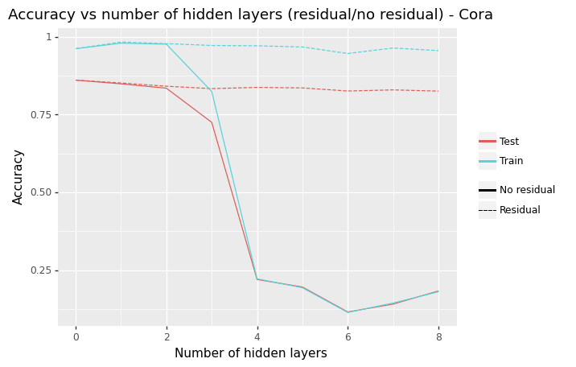
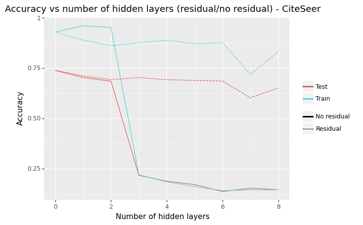
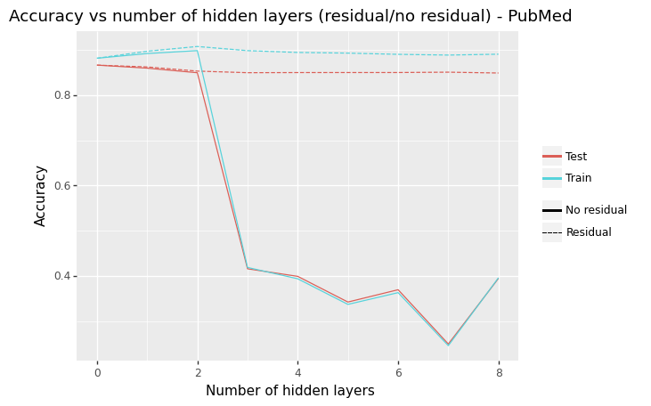

## Graph Convolutional Networks in PyTorch

Re-implementation of the work described in [Semi-Supervised Classification with Graph Convolutional Networks](https://arxiv.org/abs/1609.02907).

The implementation contains two different propagation models, the one from original GCN as described in the above paper and the Chebyshev filter based one from [Convolutional Neural Networks on Graphs with Fast Localized Spectral Filtering](https://arxiv.org/abs/1606.09375).

## Installation & Usage

To quickly check: [](https://colab.research.google.com/github/andrejmiscic/gcn-pytorch/blob/main/notebooks/gcn_testing.ipynb)

```bash
git clone https://github.com/andrejmiscic/gcn-pytorch.git
cd gcn-pytorch
```

The requirements are dependent on whether you want to use a GPU or not:

```bash
pip install -r requirements_gpu.txt
```
or
```bash
pip install -r requirements_cpu.txt
```

A simple evaluation of the model on Cora dataset:

```python
import torch

from gcn.model import TwoLayerGCN
from gcn.trainer import Trainer, RunConfig
from gcn.utils import Dataset, load_data

features, labels, train_labels, val_labels, test_labels, adjacency_matrix, \
    laplacian_matrix, num_classes = load_data(Dataset.Cora)
    
device = torch.device("cuda" if torch.cuda.is_available() else "cpu")

# training parameters
run_config = RunConfig(learning_rate=0.1, num_epochs=200, weight_decay=5e-4, output_dir="gcn/")

# constructing a GCN model
model = TwoLayerGCN(
        input_size=features.size(1),
        hidden_size=16,
        output_size=num_classes,
        dropout=0.5
    )

# training
trainer = Trainer(model)
trainer.train(features, train_labels, val_labels, adjacency_matrix, device, run_config, log=False)

# evaluating
ce_loss, accuracy = trainer.evaluate(features, test_labels, adjacency_matrix, device)
```

You can check out `notebooks/gcn_testing.ipynb` that contains all the code for reproducing the results.

To run the notebook on Google Colab follow the link 
[](https://colab.research.google.com/github/andrejmiscic/gcn-pytorch/blob/main/notebooks/gcn_testing.ipynb)

## Results

Test set accuracy for this implementation in comparison to the original paper. All results are based on public splits of analyzed datasets.
In our results we report standard deviation of accuracy based on 100 repetitions.

<table>
<thead>
  <tr>
    <th>Dataset:</th>
    <th>Cora</th>
    <th>CiteSeer</th>
    <th>PubMed</th>
  </tr>
</thead>
<tbody>
  <tr>
    <td colspan="4">Original paper</td>
  </tr>
  <tr>
    <td>GCN</td>
    <td>81.5</td>
    <td>70.3</td>
    <td>79.0</td>
  </tr>
  <tr>
    <td>Cheb (K=2)</td>
    <td>81.2</td>
    <td>69.6</td>
    <td>73.8</td>
  </tr>
  <tr>
    <td>Cheb (K=3)</td>
    <td>79.5</td>
    <td>69.8</td>
    <td>74.4</td>
  </tr>
  <tr>
    <td colspan="4">This implementation</td>
  </tr>
  <tr>
    <td>GCN</td>
    <td>82.2 ± 0.5</td>
    <td>71.0 ± 0.6</td>
    <td>79.1 ± 0.5</td>
  </tr>
  <tr>
    <td>Cheb (K=2)</td>
    <td>81.3 ± 0.7</td>
    <td>71.1 ± 0.9</td>
    <td>77.9 ± 0.9</td>
  </tr>
  <tr>
    <td>Cheb (K=3)</td>
    <td>82.5 ± 0.7</td>
    <td>71.2 ± 0.8</td>
    <td>79.0 ± 0.7</td>
  </tr>
</tbody>
</table>

Results of experiments with model depth and residual connections are shown below. Same as in the original paper the whole dataset is used and the mean accuracy of 5-fold cross validation is plotted.

<p float="left">
  
   
  
</p>

### References & Citations

* [Official GCN Tensorflow implementation](https://github.com/tkipf/gcn)
* [Spectral graph Convnets (ChebNets) implementation](https://github.com/xbresson/spectral_graph_convnets)

```bibtex
@article{kipf2016semi,
  title={Semi-supervised classification with graph convolutional networks},
  author={Kipf, Thomas N and Welling, Max},
  journal={arXiv preprint arXiv:1609.02907},
  year={2016}
}
```

```bibtex
@inproceedings{defferrard2016convolutional,
  title={Convolutional neural networks on graphs with fast localized spectral filtering},
  author={Defferrard, Micha{\"e}l and Bresson, Xavier and Vandergheynst, Pierre},
  booktitle={Advances in neural information processing systems},
  pages={3844--3852},
  year={2016}
}
```
